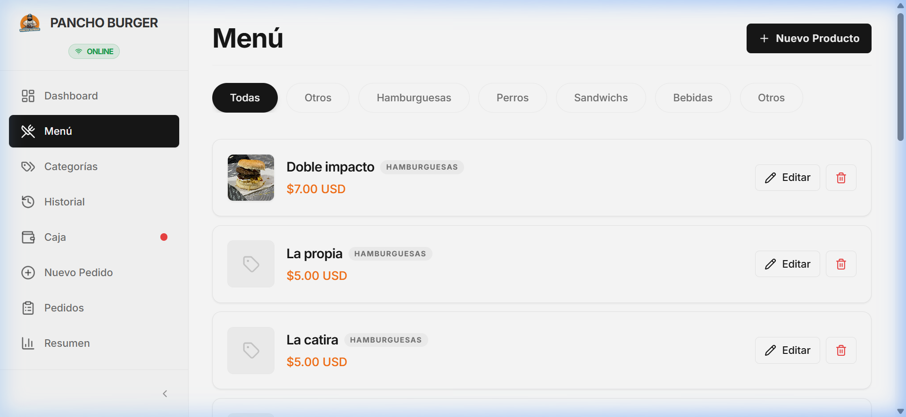
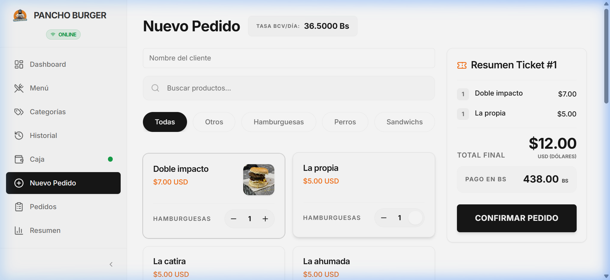
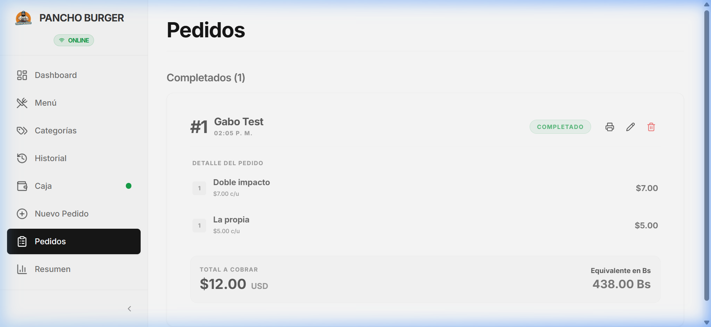

# 🍔 Pancho Burger POS

**Pancho Burger POS** es un sistema de Punto de Venta (POS) moderno y de alto rendimiento, diseñado para la eficiencia en entornos de comida rápida. Cuenta con un robusto motor de doble moneda (USD/Bs), sincronización offline-first y un panel administrativo premium.



## 🚀 Características Principales

- **💸 Soporte Multi-Moneda**: Conversión en tiempo real entre USD y Bolívares (Bs.). Los precios pueden calcularse dinámicamente según la tasa del día o fijarse en moneda local.
- **⚡ Arquitectura Offline-First**: Sigue tomando pedidos incluso sin internet. El sistema pone en cola todas las operaciones y las sincroniza automáticamente con Supabase una vez restaurada la conexión.
- **📋 Gestión de Pedidos**: Ciclo de vida completo del pedido (Pendiente → Listo → Completado) con desglose detallado de productos, precios unitarios y seguimiento de estado.
- **💹 Control de Caja**: Gestión de sesiones integrada que permite establecer la tasa de cambio diaria y actualizar masivamente los precios de los artículos fijados en bolívares.
- **📁 Menú y Categorías**: Gestión intuitiva de productos con filtrado por categorías y áreas de desplazamiento dinámico para una navegación rápida por el catálogo.
- **🖨️ Recibos Profesionales**: Tickets en CSS limpios y listos para imprimir en impresoras térmicas.

## 📸 Capturas de Pantalla

| 📋 Catálogo de Productos | 🛒 Pantalla de Pedido | 🕒 Historial y Detalles |
| :---: | :---: | :---: |
|  |  |  |

---

## 🛠️ Tecnologías Utilizadas

- **Frontend**: React 18, Vite, TypeScript
- **Estilos**: Tailwind CSS, Shadcn UI, Lucid Icons
- **Backend y Auth**: Supabase (PostgreSQL)
- **Estado Global**: React Context + Reducer con persistencia en LocalStorage
- **Sincronización**: Cola de sincronización personalizada para soporte offline

## 📦 Instalación y Configuración

1. **Clonar el repositorio**
   ```bash
   git clone https://github.com/gabod3v/quick-bite-ops.git
   cd quick-bite-ops
   ```

2. **Instalar dependencias**
   ```bash
   npm install
   ```

3. **Configuración del Entorno**
   Crea un archivo `.env` con tus credenciales de Supabase:
   ```env
   VITE_SUPABASE_URL=tu_url_de_supabase
   VITE_SUPABASE_ANON_KEY=tu_clave_de_supabase
   ```

4. **Ejecutar Servidor de Desarrollo**
   ```bash
   npm run dev
   ```

## 🤝 Contribuciones

¡Las contribuciones son bienvenidas! Siéntete libre de abrir un issue o enviar un pull request con mejoras.

---
Desarrollado con ❤️ por **gabod3v**
